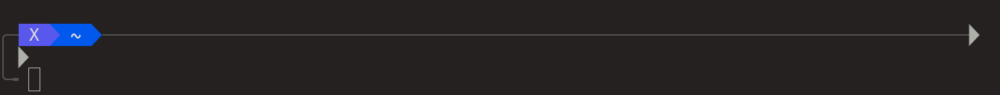
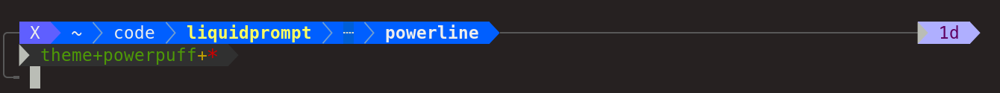
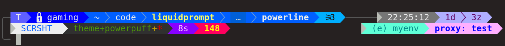

Powerpuff
*********

    This ``powerpuff`` theme go even further in rearranging the sections of the :doc:`powerline_plus` theme:

- Data sections are spread on two rows,
- each of which has a left-aligned and a right-aligned section.
- A third row hosts the actual interactive prompt.
- A horizontal line link the left and right sections of the first line.
- A new line is drawn before the first row.

The meta-sections are thus less prone to move around when more data is displayed,
and the user will find it easier to spot new information.
The horizontal line and the new line gap also helps in parsing screens with a lot of history.

Preview
=======

If there is nothing special about the current context, the appearance of
Powerline might be as simple as this:

A slightly longer prompt with more data:

When Liquid Prompt is displaying nearly everything, it may look like this:

Setup & Configuration
=====================

This theme as the same core configuration than the :doc:`power2lines` theme.

